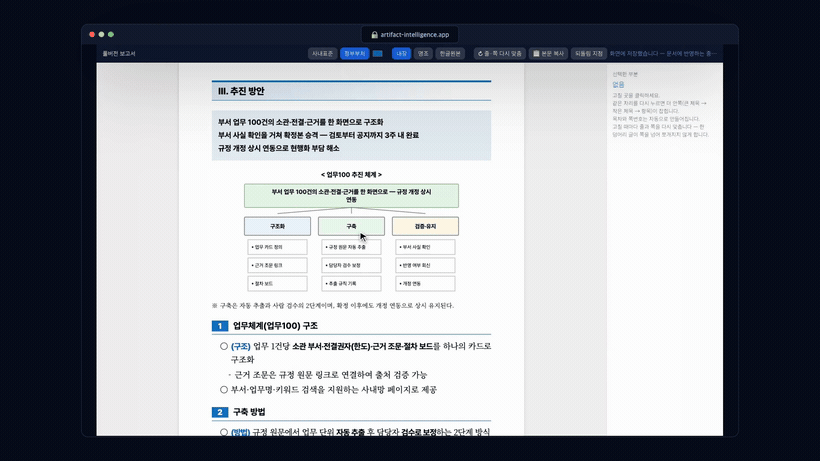

<div align="center">

# 문서지능 · Artifact Intelligence

**무엇을·누구에게·왜 보고할지와 사실·수치만 넘기면, 결재에 올릴 수 있는 문서 초안이 나옵니다.**  
목차 잡기·개조식 변환·한 장 맞춤·한글(HWPX) 변환은 규칙이 알아서 합니다. 사람은 맞는지 보고 고칠 데만 짚습니다.

먼저 써 보기 — 설치 없이 **https://artifact-intelligence.app**


</div>

---

<!-- DEMO-VIDEO -->
### 시연 영상

의도와 자료만 넣으면 → AI가 문서 구조를 설계하고 → 완성 문서를 → 도식·문구까지 항목별로 손쉽게 편집하고 → 한글(HWPX)로 내려받습니다.

[](docs/promo/promo.mp4)

▶ **[전체 영상 보기 (41초)](docs/promo/promo.mp4)** · 설치 없이 먼저 써 보기 — **https://artifact-intelligence.app**

---

## 일하는 방식을 바꿉니다

워드·한글은 빈 화면을 주고 사람이 다 채웁니다. 문서지능은 AI와 사람이 함께 일하도록 방식을 바꿉니다 — AI가 읽고 세우고 만들고 검사하면, 사람은 판단합니다. 실무자 한 명이 옆에 붙은 것에 가깝습니다.

- **의도와 맥락만 주면 됩니다.** "무엇을·누구에게·왜"와 사실·수치만 넘기면 결재에 올릴 초안이 나옵니다. 서식·목차·문체를 미리 정해 줄 필요가 없습니다.
- **설계를 먼저 보여 드립니다.** 어떤 유형으로 보고 목차를 어떻게 잡을지 초안을 만들기 전에 보여 드리고, 승인하면 그제서야 씁니다. "이건 검토보고가 아니라 결과보고였네"를 내용 쓰기 전에 바로잡습니다.
- **AI가 만들고, 사람이 검증합니다.** 백지에서 시작하지 않으니 빠르고, 규칙이 품질을 받쳐 주니 흔들리지 않습니다.
- **결과물은 HTML로, 최종본은 한글(HWPX)로.** 표·도식·삽화로 살아 있는 문서를 만들고, 그대로 한글 파일로 옮깁니다.
- **쓸수록 좋아집니다.** 사람이 고친 곳을 규칙이 배웁니다. 실무자의 손길이 쌓일수록 다음 문서가 더 정확해집니다.

품질을 **구성·문체·디자인** 세 가지로 봅니다 — 정보 흐름과 목차, 개조식 명사형 종결과 번역투 금지, 마커와 시각 위계. 실물 보고서 1만 6천여 건에서 뽑은 작성 규칙으로 이 셋을 맞추고, 서술식 종결·한 장 초과·없는 수치를 검증 게이트가 막습니다. 걸리면 스스로 고쳐 다시 냅니다.

## 결재에 올리는 문서, 여섯 가지

| 문서 | 용도 | 출력 |
|---|---|---|
| **1페이지 보고서** | 의사결정자에게 한 장으로 | HTML·PDF·HWPX |
| **풀버전 보고서** | 표지·목차·본문을 갖춘 여러 장 | HTML·PDF·HWPX |
| **시행문** | 외부 기관·국민 대상 공문 | HTML·PDF·HWPX |
| **규정** | 제정·개정 조문 | HTML·PDF·HWPX |
| **보도자료** | 언론 배포 | HTML·PDF·HWPX |
| **발표 슬라이드** | 정책보고·브리핑(16:9) | HTML·PDF·PPTX |

문서마다 정해진 서식이 있어, 같은 내용은 어느 환경에서든 글꼴까지 똑같이 나옵니다.

## 문서는 이 컴퓨터를 떠나지 않습니다

판정·작성·조립·검사·한글 변환까지, 문서를 만드는 일은 전부 설치한 컴퓨터에서 처리합니다. 넘긴 자료도, 만든 초안도, 완성한 문서도 서버로 올라가지 않습니다. 서버에서 받아 오는 것은 작성 규칙 조각뿐이고, 그마저 작업에 필요한 만큼만 그때그때 받습니다.

## 설치

> **진입은 클라이언트마다 자리가 다릅니다**(스킬·MCP 노출 방식이 달라서 — 고장이 아닙니다). 어디서든 **"문서지능 도와줘"** 라고 치면 됩니다. `/` 로 부르려면: Claude Code = `/문서지능`, Codex = `/skills` → artifact-intelligence, Cursor = `/문서지능`(아래 `.cursor/commands/` 복사 후).

**Claude Code** — 마켓플레이스로:
```
/plugin marketplace add Kminer2053/Artifact-Intelligence-public
/plugin install artifact-intelligence@artifact-intelligence
```
진입: `/문서지능` 또는 "문서지능 도와줘".

**Codex** — 플러그인 마켓플레이스로(클론 불필요):
```bash
codex plugin marketplace add Kminer2053/Artifact-Intelligence-public
codex plugin add artifact-intelligence@artifact-intelligence
```
Python 3.10+ 필요. 한글(HWPX)·업로드·규칙 조회까지 쓰려면 설치된 플러그인 폴더(`codex plugin list` 로 경로 확인)에서 `bash bin/bootstrap.sh` 를 한 번 실행하세요. 진입: **새 세션**에서 `/skills` → artifact-intelligence(설치 직후엔 스킬 목록 갱신에 새 세션이 필요), 또는 "문서지능 도와줘". (Codex `/` 상단 메뉴는 `/plugins`·`/skills`·`/mcp` 내장 명령만 보입니다.)

**Cursor** — MCP 서버 + 규칙으로 붙입니다:
```bash
git clone https://github.com/Kminer2053/Artifact-Intelligence-public
cd Artifact-Intelligence-public/artifact-intelligence
bash bin/bootstrap.sh
mkdir -p ~/.cursor/rules ~/.cursor/commands
cp .cursor/rules/artifact-intelligence.mdc ~/.cursor/rules/   # 작업 안내 규칙(자동 적용)
cp .cursor/commands/문서지능.md ~/.cursor/commands/           # /문서지능 슬래시 명령(Cursor 1.6+)
```
그다음 `~/.cursor/mcp.json` 의 `mcpServers` 에 아래를 추가하고 Cursor를 재시작하세요(`<경로>` 는 위 폴더의 절대경로):
```json
"artifact-intelligence": { "command": "<경로>/mcp/run.sh" }
```
Cursor는 MCP **도구**(판정·조립·게이트·내보내기)로 동작합니다. **진입**: `/` 를 치면 `/문서지능` 명령이 뜨거나(위 `.cursor/commands/` 복사 후, Cursor 1.6+), 그냥 **"문서지능 도와줘"** 라고 쳐도 됩니다 — 이후 규칙이 단계별 절차를 안내합니다.

**웹앱** — 설치 없이 https://artifact-intelligence.app 에서 바로 씁니다.

설치하면 첫 기동 때 규칙 조회용 토큰을 자동으로 받고, 한글(HWPX)·업로드 처리에 필요한 것도 한 번에 준비합니다. 파이썬 3.10 이상이 필요합니다.

---

<div align="center"><sub>공공기관 보고서 작성을 도구로 열어 둡니다. 문의: park2053@gmail.com</sub></div>
